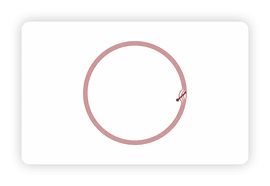
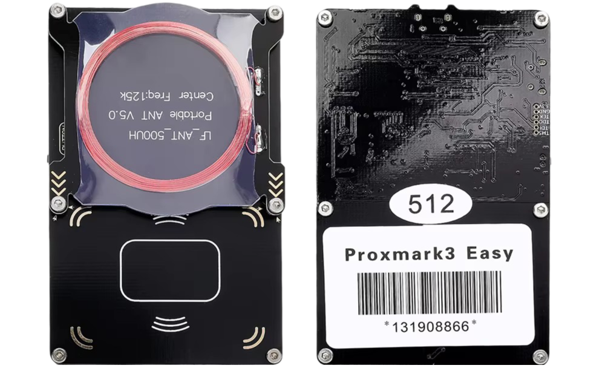

# Proxmark3 Commands
 

## Low Frequency (LF)
125 KHz or 134.2 KHz   
Protocol: ISO 11784 / 11785   
Short reading range, around 1-5 cm   
   
```
lf search
```

### T55xx
```
lf t55xx config
lf t55xx dump
lf t55xx wipe
```

### EM 410x / T55xx
Old cards (HT)
Old tags (DW) 
```
lf em 410x reader
lf em 410x clone --id <card_id>
```

### EM4x05 / EM4x69 / Indala ID
Old card (D)
```
lf em 4x05 info
lf em 4x05 chk
lf em 4x05 dump

lf indala reader
lf indala clone -r <raw>
```

---
   


## High  Frequency (HF)
13.56 MHz   
Protocol: ISO 14443A / 14443B / 15693   
Short reading range, around 2-10 cm   
(ISO 15693 RFID cards & tags could reach up to around 1 meter)   

```
hf search
```

### ISO 14443-A / Mifare Classic 1K
| Type | Gen |
|---|---|
| UID | Magic Gen 1 (backdoor command 20:23 auth) |
| CUID | Magic Gen 2 (Mifare Classic Tool compatible direct write) |
| GDM / USCUID | Magic Gen 4 |

Old card (SL)
Old debit card (M)
```
hf mf info
hf mf autopwn

hf mf wipe
hf mf csetuid -u <UID>
hf mf restore
hf mf dump --ns

hf mf chk
hf mf nested --4k --blk <Blk> -a -k <key A>
```

Old debit card (S)
```
emv list
emv test
emv gpo
```

### MIM256 / LEGIC Prime tag
Old bracelet (Blue)
```
hf legic info
hf legic list
hf legic dump
```

## Links
1. [Proxmark Wiki](https://github.com/Proxmark/proxmark3/wiki)
2. [Proxmark 3 CheatSheet](https://tagbase.ksec.co.uk/resources/proxmark3-cheatsheet/)
3. [MIFARE Classic: exposing the static encrypted nonce variant](https://eprint.iacr.org/2024/1275.pdf)
4. [Mifare HowTo](https://github.com/Proxmark/proxmark3/wiki/Mifare-HowTo)
5. [Study of vulnerabilities in MIFARE Classic cards](https://www.sidechannel.blog/en/mifare-classic-2/)
6. [RFID / NFC Card](https://nexqo.com/portfolio-items/rfid-nfc-card/)
7. [Awesome RFID Talks](https://github.com/doegox/awesome-rfid-talks)
